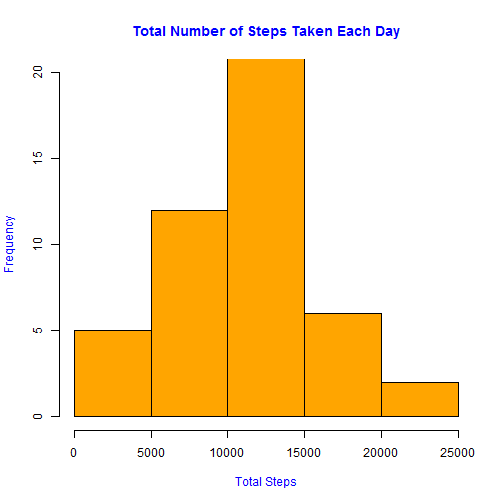
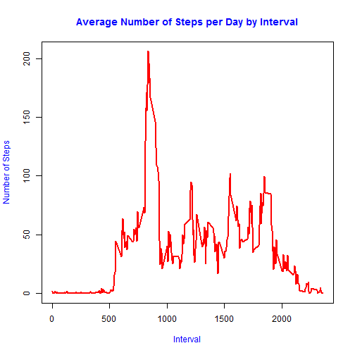
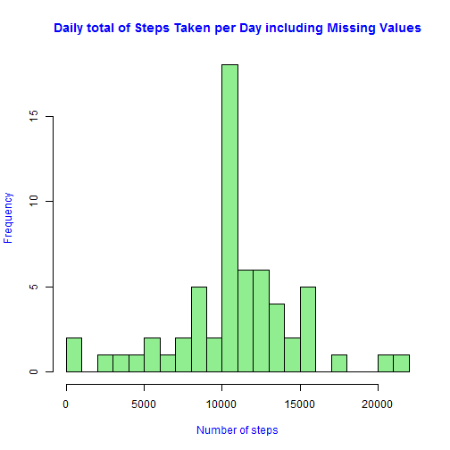
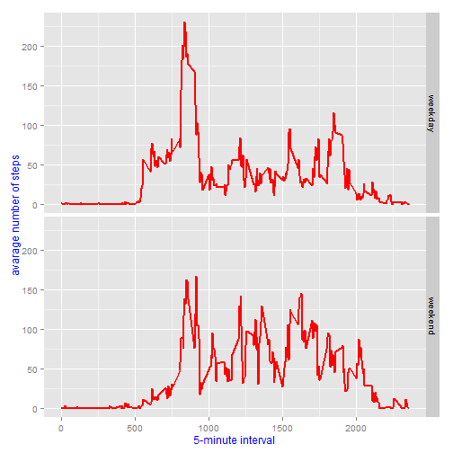

## Loading and preprocessing the data
### Load all the necessary library


#### 1. Load the data (i.e. read.csv() )

```r
unzip("activity.zip")
activity <- read.csv("activity.csv")
```

#### 2. Process/transform the data (if necessary) into a format suitable for your analysis

```r
dt_activity <- as.data.table(activity)
```


## What is mean total number of steps taken per day?
#### 1. Calculate the total number of steps taken per day

```r
dt_by_day <- dt_activity[,sum(steps), by=date]
setnames(dt_by_day, c('Date','Total'))
```

#### 2. Make a histogram of the total number of steps taken each day

```r
hist(dt_by_day$Total,right=FALSE,col="orange", col.main="blue",
     col.lab="blue", xlab="Total Steps",
     main="Total Number of Steps Taken Each Day",ylim= c(0,20))
```

 

#### 3. Calculate and report the mean and median of the total number of steps taken per day

```r
dt_by_day <- na.omit(dt_by_day)
mean_of_day <- mean(dt_by_day$Total)
median_of_day <- median(dt_by_day$Total)
```
Mean of the total number of steps taken per day:**10766**
<br>Median of the total number of steps taken per day:**10765**<br/>

## What is the average daily activity pattern?
#### 1. Make a time series plot (i.e. type = "l" ) of the 5minute interval (xaxis) and the average number of steps taken, averaged across all days (yaxis)

```r
steps_by_interval <- aggregate(steps ~ interval, dt_activity, mean)
plot(steps_by_interval$interval, steps_by_interval$steps, 
     col="red", col.main="blue", col.lab="blue", lwd=2, type="l", 
     xlab="Interval", ylab="Number of Steps",
     main="Average Number of Steps per Day by Interval")
```

 


#### 2. Which 5minute interval, on average across all the days in the dataset, contains the maximum number of steps?

```r
max_step <- steps_by_interval[which.max(steps_by_interval$steps),1]
```
The maximum number of steps on average across all the days is:**835**

## Imputing missing values
#### 1. Calculate and report the total number of missing values in the dataset (i.e. the total number of rows
with NA s)

```r
missing_values <- length(which(is.na(dt_activity$steps)))
```
Missing values in dataset:**2304**

#### 2. Devise a strategy for filling in all of the missing values in the dataset. 

```r
new_activity <- dt_activity
is_na <- is.na(new_activity$steps)
average_activity <- tapply(steps_by_interval$steps,steps_by_interval$interval, mean)
new_activity$steps[is_na] <- average_activity[as.character(new_activity$interval[is_na])]
```

#### 3. Create a new dataset that is equal to the original dataset but with the missing data filled in.

```r
daily_activity <- tapply(new_activity$steps, new_activity$date, sum, na.rm=TRUE)
```

#### 4. Make a histogram of the total number of steps taken each day and Calculate and report the mean and median total number of steps taken per day. Do these values differ from the estimates from the first part of the assignment? What is the impact of imputing missing data on the estimates of the total daily number of steps?

```r
hist(x=daily_activity,
     col="lightgreen",
     col.main="blue",
     col.lab="blue",
     breaks=20,
     xlab="Number of steps",
     main="Daily total of Steps Taken per Day including Missing Values")
```

 

```r
new_mean <- mean(daily_activity)
new_median <- median(daily_activity)
```
Mean for the total number of steps taken per day:**10766**
<br>Median for the total number of steps taken per day:**10766**<br/>

## Are there differences in activity patterns between weekdays and weekends?
#### 1. Create a new factor variable in the dataset with two levels - "weekday" and "weekend" indicating whether a given date is a weekday or weekend day.

```r
new_activity$dateType <-  ifelse(as.POSIXlt(new_activity$date)$wday %in% c(0,6), 'weekend', 'weekday')
```


#### 2. Make a panel plot containing a time series plot (i.e. type = "l" ) of the 5minute interval (xaxis)and the average number of steps taken, averaged across all weekday days or weekend days (yaxis).See the README file in the GitHub repository to see an example of what this plot should look like
using simulated data.

```r
new_average_activity <- aggregate(steps ~ interval + dateType, data=new_activity, mean)
ggplot(new_average_activity, aes(interval, steps),color="red") + 
    geom_line(size=1,colour="red") + 
    facet_grid(dateType ~ .) +
    xlab("5-minute interval") + 
    ylab("avarage number of steps") +
    theme(axis.title.x = element_text(colour = "blue"),
          axis.title.y = element_text(colour = "blue"))
```

 

